# Proyecto SQL: Análisis de Riesgo Crediticio y Morosidad


## Resumen (Overview)

## Resumen

Proyecto de análisis exploratorio de datos (EDA) sobre una cartera crediticia utilizando SQL Server (T-SQL). El análisis abarca la limpieza de datos, la identificación de patrones de morosidad, la concentración de riesgo por segmento demográfico y la detección de inconsistencias operativas en los registros de saldo deudor.

---

## Estructura del Proyecto

* [Sobre los Datos](#sobre-los-datos)
* [Tareas (Task)](#tareas-task)
* [Limpieza de Datos](#limpieza-de-datos)
* [Análisis Exploratorio de Datos e Insights](#análisis-exploratorio-de-datos-eda-e-insights)

---

## Sobre los Datos

Los datos originales simulan el *core* bancario de una entidad financiera, consolidando información demográfica (estado civil, género, ubicación) y métricas financieras (monto de inversión, tamaño de cuota, saldos actuales y pagos en mora) de miles de clientes.

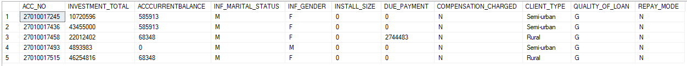

### Descripción de las Columnas

| Columna | Descripción |
| :--- | :--- |
| `ACC_NO` | Identificador único de la cuenta crediticia del cliente. |
| `INVESTMENT_TOTAL` | Monto total desembolsado o invertido originalmente en el crédito. |
| `ACCCURRENTBALANCE` | Saldo deudor actual de la cuenta a la fecha de corte. |
| `INF_MARITAL_STATUS` | Estado civil del titular (`M`: Casado, `U`: Soltero, `O`: Otro). |
| `INF_GENDER` | Género del cliente registrado en el sistema (`M`: Masculino, `F`: Femenino). |
| `INSTALL_SIZE` | Importe o tamaño de la cuota periódica exigida para el pago del préstamo. |
| `DUE_PAYMENT` | Monto total vencido o adeudado en mora por el titular. |
| `COMPENSATION_CHARGED` | Indicador de penalidad o cargo moratorio aplicado (`Y`: Sí, `N`: No). |
| `CLIENT_TYPE` | Clasificación geográfica del cliente (`Rural`, `Semi-urban`, `Urban`). |
| `QUALITY_OF_LOAN` | Calificación crediticia asignada (`G`: Buen crédito / Normal, `B`: Crédito en mora / Default). |
| `REPAY_MODE` | Modalidad o canal asignado para el repago de la deuda. |

---

## Tareas (Task)

## Preguntas de Negocio

El análisis responde a 10 consultas orientadas a la evaluación del riesgo y la estructura de la cartera:

1. **Distribución de Cartera:** ¿Cuál es el volumen total invertido y el saldo promedio según el tipo de cliente?
2. **Estado Civil y Riesgo:** ¿Cuál es la cantidad total de préstamos y cuántos de ellos están clasificados como malos agrupados por estado civil?
3. **Top 5 Deudores:** ¿Quiénes son los 5 clientes con el mayor pago atrasado que tienen una mala calificación crediticia?
4. **Impacto de Cuotas (Bandas):** ¿Cómo varía la calidad del préstamo si clasificamos el tamaño de la cuota en rangos personalizados?
5. **Penalidad y Género:** ¿Cuál es la suma total de pagos atrasados agrupada por género para clientes con compensación cobrada?
6. **Detección de Anomalías:** ¿Cuántos clientes presentan un saldo actual que supera su préstamo inicial?
7. **Impacto del Riesgo (Subconsultas):** ¿Los clientes en mora tienen un pago atrasado superior al promedio general de toda la cartera?
8. **Análisis de Mora (CTE):** ¿Cuál es el promedio de cuota en el sector rural según su modo de pago?
9. **Ranking de Deudores Críticos:** Generar un ranking de los prestatarios con mayor deuda dentro de cada tipo de cliente.
10. **Acumulado de Inversión en Riesgo (Running Total):** ¿Cuál es la evolución del monto total invertido acumulado para los préstamos malos?

---

## Limpieza de Datos

Antes de realizar el análisis, es fundamental asegurar la consistencia de los datos. El trabajo se centró en la validación de la tabla `TB_CLIENTE_RIESGO`, limpiando las filas vacías generadas durante la importación del archivo plano (CSV) y validando la unicidad de las cuentas.

**Valores Nulos o Faltantes:**
Se identificaron y eliminaron filas donde el identificador único (`ACC_NO`) era nulo para evitar sesgos en el cálculo de provisiones.

```sql
-- Verificar valores faltantes en la tabla principal
SELECT COUNT(*) AS MissingValues
FROM TB_CLIENTE_RIESGO
WHERE ACC_NO IS NULL;

-- Eliminar las filas nulas importadas del archivo CSV
DELETE FROM TB_CLIENTE_RIESGO
WHERE ACC_NO IS NULL;
```

##  Análisis Exploratorio de Datos (EDA) e Insights

### Pregunta #1: ¿Cuál es el volumen total invertido y el saldo promedio según el tipo de cliente?

Cálculo del volumen colocado, saldo promedio y número de créditos agrupados por tipo de cliente, excluyendo registros nulos o inconsistentes.

```sql
-- Distribución de Cartera: Volumen, saldo promedio y cantidad de créditos --

SELECT 
    CLIENT_TYPE AS Tipo_Cliente,
    COUNT(ACC_NO) AS Cantidad_Prestamos,
    SUM(INVESTMENT_TOTAL) AS Volumen_Invertido_Total,
    ROUND(AVG(ACCCURRENTBALANCE), 2) AS Saldo_Actual_Promedio
FROM TB_CLIENTE_RIESGO
WHERE CLIENT_TYPE IS NOT NULL AND CLIENT_TYPE <> '0'
GROUP BY CLIENT_TYPE
ORDER BY Volumen_Invertido_Total DESC;
```

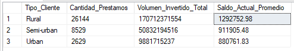


*Volumen invertido y saldo actual promedio segmentado por zona*

El sector Rural concentra el mayor volumen de colocación (26,144 créditos) y presenta el saldo promedio más alto (1.29 millones), superando ampliamente a las zonas urbana y semiurbana.

## Pregunta #2: ¿Cuál es la cantidad total de préstamos y la tasa de morosidad por estado civil?
Cálculo de la tasa de morosidad porcentual por estado civil, filtrando operaciones con calificación de riesgo 'B'.

```sql
-- Volumen de créditos y tasa de morosidad por estado civil --

SELECT 
    INF_MARITAL_STATUS AS Estado_Civil,
    COUNT(ACC_NO) AS Total_Prestamos,
    SUM(CASE WHEN QUALITY_OF_LOAN = 'B' THEN 1 ELSE 0 END) AS Prestamos_Mora,
    CAST((SUM(CASE WHEN QUALITY_OF_LOAN = 'B' THEN 1.0 ELSE 0 END) * 100.0) / COUNT(ACC_NO) AS DECIMAL(5, 2)) AS Tasa_Morosidad_Pct
FROM TB_CLIENTE_RIESGO
WHERE INF_MARITAL_STATUS IS NOT NULL
GROUP BY INF_MARITAL_STATUS
ORDER BY Tasa_Morosidad_Pct DESC;
```
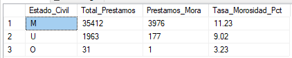

*Tasa de morosidad porcentual por categoría de estado civil*

El segmento casado (M) no solo representa el 94% de las operaciones, sino que registra la tasa de morosidad más alta (11.23%), concentrando prácticamente todo el riesgo de incumplimiento.

### Pregunta #3: ¿Quiénes son los 5 clientes con el mayor pago atrasado en mala calificación?

Identificación de los 5 clientes con mayor saldo vencido dentro del segmento en mora ('B').

```sql
-- Top 5 Deudores: Clientes en mora con el mayor monto adeudado --

SELECT TOP 5
    ACC_NO AS Numero_Cuenta,
    CLIENT_TYPE AS Tipo_Cliente,
    INF_MARITAL_STATUS AS Estado_Civil,
    INVESTMENT_TOTAL AS Monto_Prestamo,
    ACCCURRENTBALANCE AS Saldo_Actual,
    DUE_PAYMENT AS Monto_Atrasado,
    QUALITY_OF_LOAN AS Calificacion
FROM TB_CLIENTE_RIESGO
WHERE QUALITY_OF_LOAN = 'B'
ORDER BY DUE_PAYMENT DESC;
```

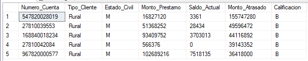

*Identificación nominal de los 5 mayores prestatarios en mora*

Los 5 principales deudores en mora pertenecen en su totalidad al segmento Rural y al estado civil Casado (M), encabezados por un cliente que registra un monto atrasado superior a los 155 millones.

Esta coincidencia demográfica en los casos más extremos confirma que el riesgo de severidad de pérdida (Loss Given Default - LGD) está altamente concentrado. Este grupo requiere planes de reestructuración y cobranza judicial prioritaria para contener el deterioro de provisiones.

## Pregunta #4: ¿Cómo varía la calidad del préstamo según rangos del tamaño de cuota?
Segmentación de la cartera en rangos de cuota mensual y cálculo de la morosidad respectiva por tramo.

```sql
-- Impacto de Cuotas: Segmentación por tamaño de cuota y tasa de morosidad --

SELECT 
    CASE 
        WHEN INSTALL_SIZE = 0 THEN '0. Sin Cuota Fija'
        WHEN INSTALL_SIZE BETWEEN 0.01 AND 5000 THEN '1. Cuota Baja (<= 5K)'
        WHEN INSTALL_SIZE BETWEEN 5000.01 AND 20000 THEN '2. Cuota Media (5K - 20K)'
        ELSE '3. Cuota Alta (> 20K)'
    END AS Rango_Cuota,
    COUNT(ACC_NO) AS Total_Creditos,
    SUM(CASE WHEN QUALITY_OF_LOAN = 'B' THEN 1 ELSE 0 END) AS Creditos_Mora,
    CAST((SUM(CASE WHEN QUALITY_OF_LOAN = 'B' THEN 1.0 ELSE 0 END) * 100.0) / COUNT(ACC_NO) AS DECIMAL(5, 2)) AS Tasa_Morosidad_Pct
FROM TB_CLIENTE_RIESGO
WHERE INSTALL_SIZE IS NOT NULL
GROUP BY 
    CASE 
        WHEN INSTALL_SIZE = 0 THEN '0. Sin Cuota Fija'
        WHEN INSTALL_SIZE BETWEEN 0.01 AND 5000 THEN '1. Cuota Baja (<= 5K)'
        WHEN INSTALL_SIZE BETWEEN 5000.01 AND 20000 THEN '2. Cuota Media (5K - 20K)'
        ELSE '3. Cuota Alta (> 20K)'
    END
ORDER BY Rango_Cuota;
```
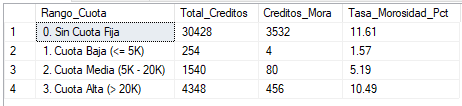

*Porcentaje de morosidad distribuido por exigencia de pago mensual*

Se observa un salto notable en la morosidad al superar los 20,000 de cuota (10.49% frente a 1.57% en cuotas bajas). Asimismo, los créditos sin cuota fija representan la mayor parte de la mora absoluta.

## Pregunta #5: ¿Cuál es la suma total de pagos atrasados por género para clientes penalizados?
Cálculo del volumen de clientes penalizados y del monto total vencido, agrupado por género.

```sql
-- Penalidad y Género: Total de pagos atrasados para clientes con compensación --

SELECT 
    INF_GENDER AS Genero,
    COUNT(ACC_NO) AS Clientes_Penalizados,
    SUM(DUE_PAYMENT) AS Total_Pagos_Atrasados
FROM TB_CLIENTE_RIESGO
WHERE COMPENSATION_CHARGED = 'Y' 
  AND INF_GENDER IS NOT NULL
GROUP BY INF_GENDER
ORDER BY Total_Pagos_Atrasados DESC;
```
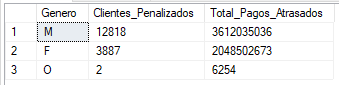

*Volumen de deuda en mora y cantidad de clientes penalizados por género*

El segmento masculino concentra el 76% de los clientes penalizados y la mayor deuda vencida absoluta (3,612 millones). Sin embargo, el segmento femenino registra una deuda promedio por caso sustancialmente mayor (527 mil vs. 281 mil en hombres), lo que evidencia un impacto unitario más severo cuando incurre en mora.

## Pregunta #6: ¿Cuántos clientes presentan un saldo actual que supera su préstamo inicial?
Auditoría para identificar operaciones donde el saldo actual reportado supera el monto original financiado y cálculo de la diferencia total.

```sql
-- Detección de Anomalías: Clientes con saldo actual mayor a la inversión inicial --

SELECT 
    COUNT(ACC_NO) AS Clientes_Con_Anomalia,
    SUM(INVESTMENT_TOTAL) AS Inversion_Original_Total,
    SUM(ACCCURRENTBALANCE) AS Saldo_Actual_Total,
    SUM(ACCCURRENTBALANCE - INVESTMENT_TOTAL) AS Diferencia_Excedente
FROM TB_CLIENTE_RIESGO
WHERE ACCCURRENTBALANCE > INVESTMENT_TOTAL;
```
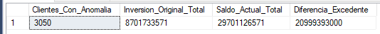

*Desfase total en cuentas donde la deuda actual excede el desembolso inicial* 

Se detectaron 3,050 cuentas cuyo saldo deudor excede el capital original, acumulando una diferencia de 20,999 millones. Este desfase responde típicamente a la acumulación de intereses moratorios no cancelados o a inconsistencias en la migración de datos del sistema transaccional, requiriendo conciliación contable.

## Pregunta #7: ¿Los clientes en mora tienen un pago atrasado superior al promedio global?
Filtrado de operaciones en mora ('B') cuyo monto atrasado supera el promedio general de la cartera mediante una subconsulta escalar.

```sql
-- Impacto del Riesgo: Clientes morosos ('B') con deuda superior al promedio general --

SELECT 
    COUNT(ACC_NO) AS Morosos_Criticos,
    ROUND(AVG(DUE_PAYMENT), 2) AS Promedio_Atraso_De_Este_Grupo,
    ROUND((SELECT AVG(DUE_PAYMENT) FROM TB_CLIENTE_RIESGO), 2) AS Promedio_Atraso_Global
FROM TB_CLIENTE_RIESGO
WHERE QUALITY_OF_LOAN = 'B' 
  AND DUE_PAYMENT > (SELECT AVG(DUE_PAYMENT) FROM TB_CLIENTE_RIESGO);
```  
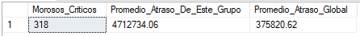

*Comparativa del riesgo extremo versus el atraso promedio de toda la cartera*

De toda la cartera, 318 clientes en mora superan el pago atrasado promedio global (375,820), alcanzando una media de 4.71 millones en este subgrupo. Esta concentración focaliza el riesgo patrimonial en menos del 1% de las cuentas.

## Pregunta #8: ¿Cuál es el promedio de cuota en el sector rural según su modo de pago?
Uso de una CTE para segmentar la cartera rural y calcular la cuota promedio según la modalidad de pago asignada.

```sql
-- Análisis de Mora (CTE): Promedio de cuota en el sector rural por modo de pago --

WITH Clientes_Rurales AS (
    SELECT 
        ACC_NO,
        REPAY_MODE,
        INSTALL_SIZE
    FROM TB_CLIENTE_RIESGO
    WHERE CLIENT_TYPE = 'Rural' 
      AND INSTALL_SIZE IS NOT NULL
)
SELECT 
    REPAY_MODE AS Modo_Pago,
    COUNT(ACC_NO) AS Total_Clientes_Rurales,
    ROUND(AVG(INSTALL_SIZE), 2) AS Promedio_Cuota
FROM Clientes_Rurales
GROUP BY REPAY_MODE
ORDER BY Promedio_Cuota DESC;
```
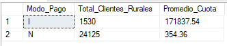

*Tamaño de cuota mensual promedio por modo de pago en el segmento Rural*

La cartera rural se divide en dos perfiles opuestos: la modalidad 'N' abarca el 94% de las operaciones con una cuota promedio baja (354.36), mientras que la modalidad 'I' agrupa 1,530 cuentas con una cuota promedio de 171,837. Esto evidencia la coexistencia de microcrédito minorista y crédito agropecuario/comercial en la misma base.

## Pregunta #9: Generar un ranking de los prestatarios con mayor deuda dentro de cada tipo de cliente.
Aplicación de ROW_NUMBER() particionado por tipo de cliente para clasificar los créditos con mayor monto en mora dentro de cada zona.
```sql
-- Ranking regionalizado de deudores críticos --

SELECT 
    CLIENT_TYPE AS Tipo_Cliente,
    ACC_NO AS Numero_Cuenta,
    DUE_PAYMENT AS Monto_Atrasado,
    ROW_NUMBER() OVER (PARTITION BY CLIENT_TYPE ORDER BY DUE_PAYMENT DESC) AS Ranking_Riesgo
FROM TB_CLIENTE_RIESGO
WHERE DUE_PAYMENT > 0
  AND CLIENT_TYPE IS NOT NULL 
  AND CLIENT_TYPE <> '0'
ORDER BY Tipo_Cliente, Ranking_Riesgo;
```
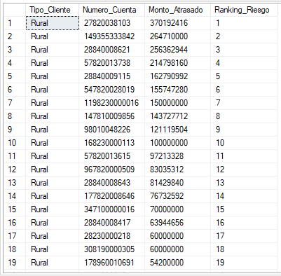

*Top de clientes con mayor monto atrasado particionado por segmento*

Particionar el ranking por segmento evita que la magnitud de la deuda rural (con saldos individuales de hasta 370 millones) opaque a los deudores críticos de zonas urbanas y semiurbanas, facilitando estrategias de cobranza segmentadas por plaza.

### Pregunta #10: ¿Cuál es la evolución del monto total invertido acumulado para los préstamos malos?

Cálculo del saldo original acumulado (*running total*) para la cartera en mora ('B'), ordenado descendentemente por saldo deudor actual.

```sql
-- Acumulado de Inversión en Riesgo (Running Total para préstamos malos) --

SELECT 
    ACC_NO AS Numero_Cuenta,
    CLIENT_TYPE AS Tipo_Cliente,
    ACCCURRENTBALANCE AS Saldo_Actual,
    INVESTMENT_TOTAL AS Inversion_Original,
    SUM(INVESTMENT_TOTAL) OVER (ORDER BY ACCCURRENTBALANCE DESC) AS Inversion_Acumulada_Riesgo
FROM TB_CLIENTE_RIESGO
WHERE QUALITY_OF_LOAN = 'B'
ORDER BY Saldo_Actual DESC;
```
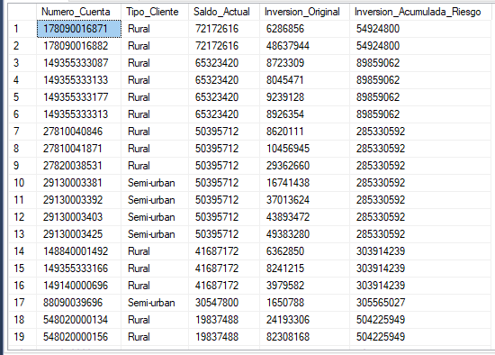

*Evolución acumulada del capital original en riesgo ordenado por saldo deudor actual*

Las primeras 19 cuentas en mora concentran una exposición original acumulada de más de 504 millones. La presencia de cuentas con saldos idénticos sugiere operaciones asociadas a un mismo grupo económico o desembolsos corporativos simultáneos, justificando límites consolidados por titular.

---
## Conclusiones Clave

* **Se identificó una concentración crítica de riesgo en el sector rural:** Aunque este segmento concentra el mayor volumen de cartera, también reúne los saldos promedio más altos y los principales clientes en *default*, evidenciando la necesidad de fijar topes de exposición por titular y diversificar hacia zonas urbanas.

* **Se comprobó que cuotas elevadas detonan el impago:** La morosidad escala del 1.57% en cuotas bajas a más del 10.49% cuando el pago supera los 20,000, demostrando que compromisos de pago altos asfixian la liquidez y exigiendo ajustar el ratio cuota/ingreso en originación.

* **Se aislaron los casos críticos que concentran la pérdida de capital:** Apenas 318 clientes morosos mantienen una deuda 12 veces superior al promedio global, y las primeras 19 cuentas del *running total* acumulan más de 504 millones, permitiendo priorizar la cobranza judicial en este grupo clave.

* **Se detectó mayor severidad de deuda en el segmento femenino:** Pese a que los hombres concentran el mayor volumen total adeudado, las mujeres con penalidades registran una deuda promedio por persona sustancialmente más alta, lo que amerita alertas tempranas específicas para este perfil.

* **Se descubrieron inconsistencias contables en el core bancario:** Se hallaron 3,050 registros donde el saldo actual excede el monto desembolsado (con un desfase acumulado de 20.9 mil millones), haciendo urgente implementar validaciones automáticas de datos y conciliar la capitalización de intereses.